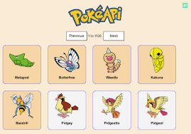
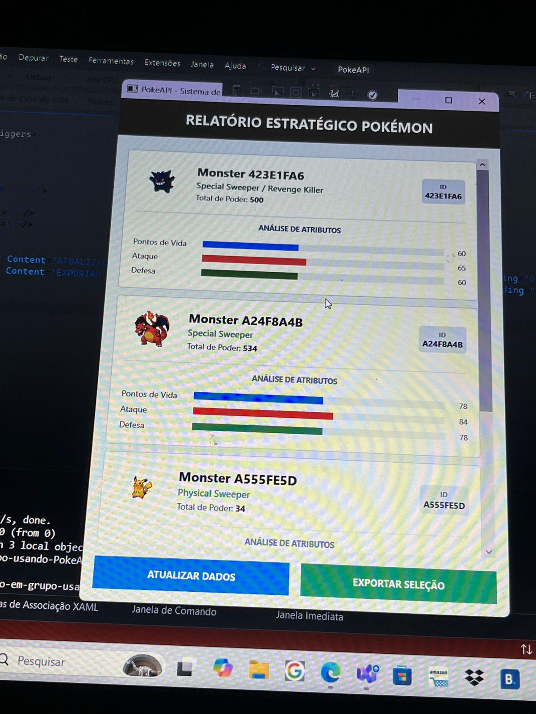

# PokeAPI

##  Introdução:
A PokeAPI, no contexto deste projeto, é uma plataforma centralizada e estruturada para integrar dados, funcionando como um contrato estável de comunicação. Ela coleta registros brutos sobre Pokémons, padroniza essas informações no formato universal JSON e as distribui em rede. A API elimina a necessidade de planilhas locais ou processos manuais descentralizados, servindo como uma ponte segura que garante que todas as informações trafeguem e fiquem guardadas sem perdas no banco de dados. O que o projeto está fazendo e tem como objetivo principal é automatizar completamente o ciclo de vida desses dados para gerar relatórios de análise competitiva. O sistema consome as informações diretamente da API, trata possíveis instabilidades de rede e limpa dados ausentes em tempo real. Em seguida, uma inteligência lógica processa os atributos recebidos para calcular métricas de poder total e classificar de forma automatizada a função tática de cada criatura, organizando os resultados em rankings estratégicos e visões analíticas prontas para o usuário final.

---

##  Integração com a API Externa:
O sistema foi projetado para atuar como um consumidor direto da API desenvolvida pelo **Erick** (a qual centraliza os dados cadastrados na interface WPF do **Vinícius**). 
* A comunicação é feita de forma assíncrona (`async/await`) utilizando o cliente nativo do .NET (`HttpClient`).
* O fluxo lê o arquivo JSON bruto enviado pelo servidor e faz o mapeamento automático para a classe de transferência de dados (`PokemonDTO`), garantindo  com até 3 tentativas de conexão em caso de instabilidade de rede.

---

##  Minha Parte: Camada de Inteligência e Relatórios
Ao invés de apenas exibir dados brutos na tela, a minha contribuição foca em transformar registros em relatórios através de regras de negócio aplicadas, como:

* **Cálculo Automático de BST (Base Stat Total):** O sistema varre os atributos recebidos da API (`HP`, `Attack`, `Defense`, `SpAttack`, `SpDefense`, `Speed`) e calcula instantaneamente o poder total de base do Pokémon.
* **Definição de Role Competitiva:** Uma lógica analítica compara os status de ataque e defesa de cada criatura para classificá-la automaticamente em funções estratégicas (como *Physical Sweeper* ou *Wall / Tank*).
* **Módulo de Ranking Dinâmico (`RankingView`):** Utiliza tecnologia LINQ para filtrar e ordenar a lista de dados recebida, gerando um pódio automatizado dos Pokémons mais fortes do banco de dados com base no BST.
* **Preparação para Gráficos de Análise (`RadarView`):** Estrutura modular isolada e pronta para receber o objeto tratado e plotar gráficos de teia (radar) com a distribuição de atributos.

---

#### Escola De Programação e Robótica - SENAI
#### Orientado por: Fred Aguiar
